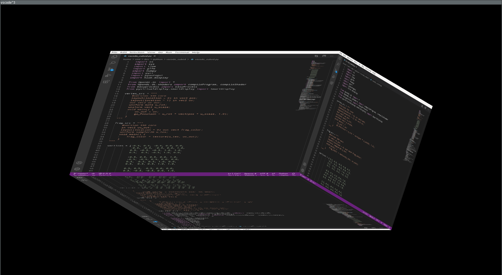

vscode-cubed
---

- Do you <3 vscode and electron, but the performance feels overwhelming? No problem!
- Do you feel like you're too productive at times? Say no more!
- Do you <3 cubes? - No worries!
- Do you <3 [vim-cubed](https://github.com/oakes/vim_cubed) but:
    - Don't <3 vim? - No sweat!
    - Can't figure out how to exit vim? - No problem whatsoever!

Armed to the teeth with all the latest and greatest technology and advances in the cubic text editor field to provide you with the tools _you need_ and _deserve_, may I present to you: _vscode-cubed_

### No more vim, no more 2D, no more tears! 

  

## Dependencies:

- Loonix (or something like that)
- vscode (obviously)
- opengl (d'oh)
- xvfb (yes)

- python3 (oh my...)
    - glfw
    - numpy
    - pyrr
    - pyautogui
    - pyopengl
    - easyprocess
    - pyvirtualdisplay
    - pyscreenshot
    - pillow

## Usage:
`python3 vscode_cubed.py /path/to/your/file`

## License:
MIT
